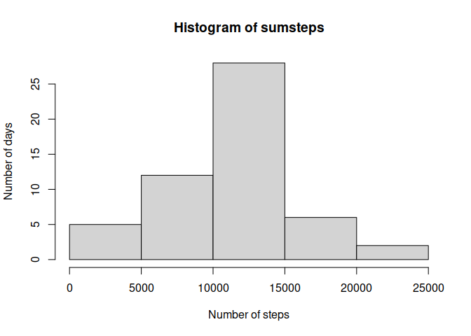
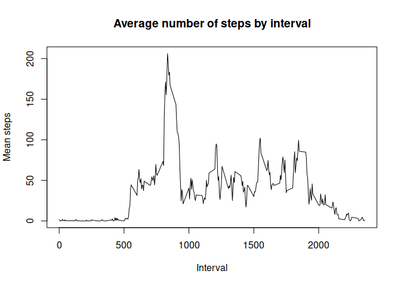
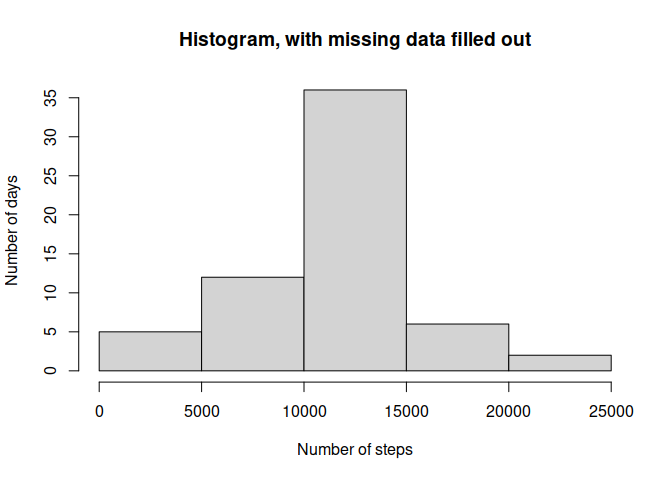
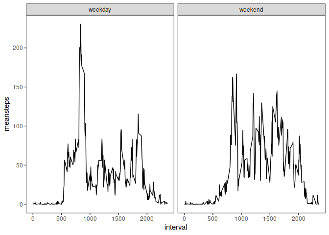

## Loading and preprocessing the data


``` r
library(lubridate)
```

```
## 
## Attaching package: 'lubridate'
```

```
## The following objects are masked from 'package:base':
## 
##     date, intersect, setdiff, union
```

``` r
library(tidyr)
library(ggplot2)
activity <- read.csv("activity/activity.csv")
```


``` r
head(activity) # first inspection
```

```
##   steps       date interval
## 1    NA 2012-10-01        0
## 2    NA 2012-10-01        5
## 3    NA 2012-10-01       10
## 4    NA 2012-10-01       15
## 5    NA 2012-10-01       20
## 6    NA 2012-10-01       25
```

``` r
activity$day<-ymd(activity$date) #transform date format
activity$date<-NULL #delete unformatted date col
names(activity) #double check if ok?
```

```
## [1] "steps"    "interval" "day"
```

## What is the mean total number of steps taken per day?

The data shows a mean of **10,766** daily steps, and a median of **10,765** steps per day. 


``` r
sumsteps<-tapply(activity$steps, activity$day, sum) #get sum of steps by day
summary(sumsteps) #get mean, median, and quartiles
```

```
##    Min. 1st Qu.  Median    Mean 3rd Qu.    Max.    NA's 
##      41    8841   10765   10766   13294   21194       8
```

How are the daily number of steps distributed across these 61 days? The following histogram shows a relatively normal distribution, with **28** days where the number of steps fluctuated between **10,000 and 15,000**.


``` r
hist(sumsteps, ylab="Number of days", xlab="Number of steps")
```

<!-- -->

## What is the average daily activity pattern?

The 5-minute intervals between 0:00 and 5:00 am show little to no activity, while the maximum mean number of steps taken in a 5-minute interval is **206**, on interval `835` (8:35 am)^[It took me a thousand years to realize that the intervals are showing the actual time and are NOT numbered in correlative order.].


``` r
avsteps<-tapply(activity$steps, activity$interval, mean, na.rm=TRUE)
plot(x=names(avsteps), y=avsteps, type="l", ylab="Mean steps", xlab="Interval", main="Average number of steps by interval")
```

<!-- -->

``` r
max(avsteps)
```

```
## [1] 206.1698
```

``` r
which.max(avsteps)
```

```
## 835 
## 104
```

``` r
summary(avsteps)
```

```
##    Min. 1st Qu.  Median    Mean 3rd Qu.    Max. 
##   0.000   2.486  34.113  37.383  52.835 206.170
```

## Imputing missing values

How many missing values do we have?


``` r
sum(is.na(activity$steps))
```

```
## [1] 2304
```

Strategy: add the mean by interval (since there are days with no data at all). We add a new column to the `activity` dataframe, named `steps_noNA` which replicates the `steps` column and fills out the missing data via `ifelse()` in base R. 


``` r
activity$steps_noNA<-ifelse(activity$interval %in% names(avsteps) & is.na(activity$steps)==TRUE, avsteps, activity$steps)
```

Now we make a histogram of the total number of steps taken each day:


``` r
sumstepsnoNA<-tapply(activity$steps_noNA, activity$day, sum)
hist(sumstepsnoNA, ylab="Number of days", xlab="Number of steps", main="Histogram, with missing data filled out")
```

<!-- -->

The histogram looks roughly the same in terms of the overall distribution, but we see a higher number of days where the count of steps was between 10,000 and 15,000. We check the new mean and median daily values and compare them to the old ones:


``` r
summary(sumstepsnoNA) #new data
```

```
##    Min. 1st Qu.  Median    Mean 3rd Qu.    Max. 
##      41    9819   10766   10766   12811   21194
```

``` r
summary(sumsteps) #old data
```

```
##    Min. 1st Qu.  Median    Mean 3rd Qu.    Max.    NA's 
##      41    8841   10765   10766   13294   21194       8
```

We see that imputing missing data on the estimates of the total daily number of steps yields the exact same mean and median. However, the first and third quartiles show differences of about a thousand steps.

## Are there differences in activity patterns between weekdays and weekends?

We create a new column with the variable `week`, which shows whether the day in question is a weekday or a weekend.


``` r
activity$week<-ifelse(wday(activity$day, week_start = 1) %in% c(6,7) == TRUE, "weekend", "weekday")
```

Now we create a plot showing differences between weekdays and weekends.


``` r
#create df with mean vals by interval and weekday/weekend
#we use the vector with no missing data
d<-data.frame(cbind(tapply(activity$steps_noNA, list(activity$interval, activity$week), mean)), interval=unique(activity$interval))
#turn into long format for easy plotting
lf<- gather(d, whichday, meansteps, weekday:weekend, factor_key=TRUE)
ggplot(lf, aes(x=interval, y=meansteps)) + geom_line() + facet_wrap(~ whichday) + theme_bw() + theme(panel.grid.major = element_blank(), panel.grid.minor = element_blank()) #I thought using ggplot would be easier but the ugly default background takes some effort to remove :(
```

<!-- -->

In general, the analysis shows that in average, more steps were taken during weekdays (mean=35.61) than weekends (mean=42.37).


``` r
tapply(lf$meansteps, lf$whichday, mean)
```

```
##  weekday  weekend 
## 35.61058 42.36640
```

But is this difference significant? We check with a t-test:


``` r
t.test(d$weekday, d$weekend)
```

```
## 
## 	Welch Two Sample t-test
## 
## data:  d$weekday and d$weekend
## t = -1.9264, df = 573.72, p-value = 0.05455
## alternative hypothesis: true difference in means is not equal to 0
## 95 percent confidence interval:
##  -13.643958   0.132318
## sample estimates:
## mean of x mean of y 
##  35.61058  42.36640
```

The difference doesn't seem to be significantly different (t = -1.93, df = 573.72, p = 0.055 [-13.64, 0.13]).
